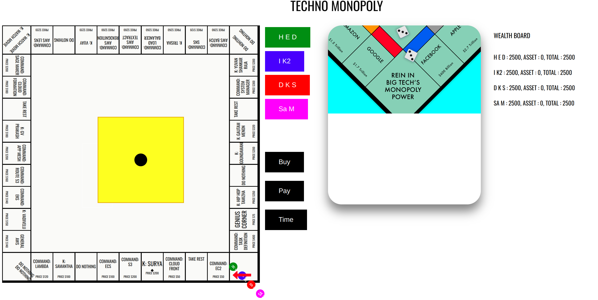
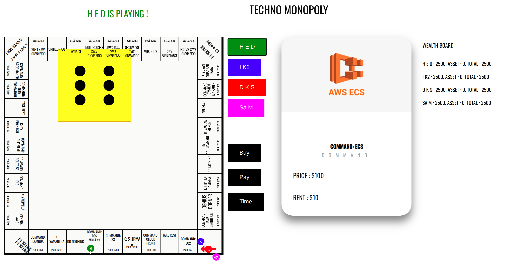
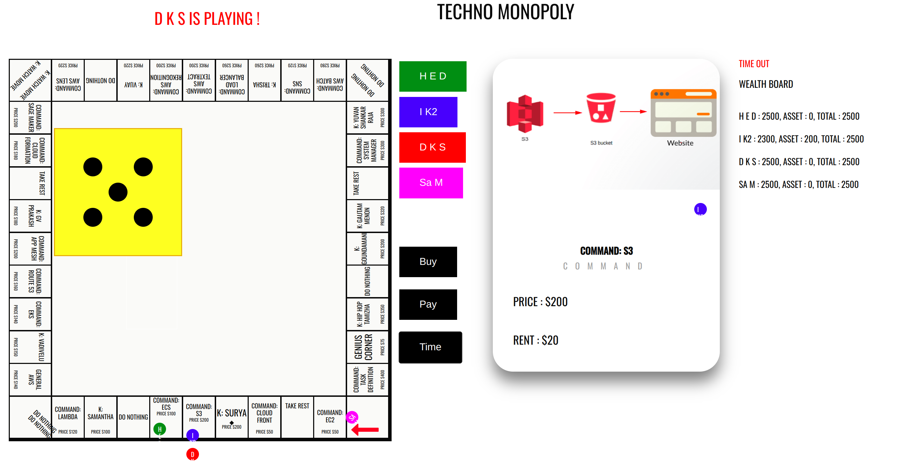

# Tech-Monopoly

A technical monopoly refers to a market situation where a single entity or company possesses exclusive control over a specific technology, product, or service due to factors such as patents, proprietary knowledge, or advanced infrastructure. This monopoly often inhibits competition and can result in limited innovation and higher prices for consumers, as access to the technology or service is restricted.

code reference : 

https://codepen.io/johnnycopes/pen/yzQyMp

https://freefrontend.com/css-cards/

https://www.geeksforgeeks.org/building-a-dice-game-using-javascript/

run index.html file

